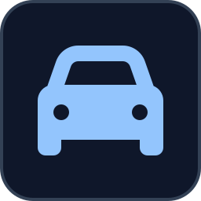

<p align="center">
  
</p>

# DroneMobile MQTT Bridge

<!-- BADGES:START -->

[](LICENSE.md)
[](CONTRIBUTING.md)
<!-- BADGES:END -->

## Table of Contents

- [Description](#description)
- [Features](#features)
- [Requirements](#requirements)
- [Installation](#installation)
- [Usage](#usage)
- [Home Assistant](#home-assistant)
- [Configuration](#configuration)
- [Known limitations](#known-limitations)
- [Architecture](#architecture)
- [Credits](#credits)
- [Contributing](#contributing)
- [License](#license)

## Description

A cloud-poll bridge for [DroneMobile](https://www.dronemobile.com/) vehicle
telematics. It authenticates against DroneMobile's own Cognito user pool —
the same one the iOS/Android app uses — and republishes nearly everything the
account's plan can return over MQTT with Home Assistant auto-discovery:
live telemetry, the device-message and alert-event history, configured
geofences and alert rules, plan capabilities, and DroneMobile's own service
status.

It runs **alongside** Home Assistant's official `drone_mobile` integration
without collision: every entity lives under its own device with a distinct
`unique_id` prefix, so both can coexist while you decide whether to retire
either one. Unlike the official integration, this bridge does not expose the
lock/unlock/remote-start/panic controls — those mutate the vehicle, and the
official integration already owns them.

## Features

- **Multi-vehicle**, discovered dynamically — every vehicle on the account
  gets its own Home Assistant device and its own event streams.
- **Three independent poll cadences** so expensive or rarely-changing data
  (plan info, alert rules, geofences, firmware) isn't re-fetched as often as
  live telemetry.
- **Device-message and alert-event history**, not just current state —
  paginated incremental polling plus a startup backfill window, published as
  one-shot MQTT events with their original timestamps for a time-series
  database to ingest.
- **Per-geofence presence binaries**, computed client-side from the
  vehicle's current position against each configured geofence's centre and
  radius.
- **Firmware-update tracking** — compares the vehicle's current controller
  firmware against the latest version DroneMobile has published for that
  controller model.
- **DroneMobile's own service status** (open incidents, active/upcoming
  maintenance windows) from their public StatusPage, no auth required.
- **Automatic re-authentication** on token expiry and on any unexpected 401.

## Requirements

- **Docker** with the Compose plugin, **v2.17 or newer** (for `build.additional_contexts`)
- An MQTT broker reachable from the container (e.g. Mosquitto)
- A DroneMobile account with at least one vehicle on a plan that grants API
  access (a "Basic" plan is enough for most of what this bridge publishes;
  see [Known limitations](#known-limitations))
- Optionally, Home Assistant with its MQTT integration configured, to pick up
  the auto-discovered entities

## Installation

```bash
git clone https://github.com/geoffmyers/dronemobile-mqtt-bridge.git
cd dronemobile-mqtt-bridge

cp .env.example .env
cp docker-compose.example.yml docker-compose.yml
```

Edit `.env` with your DroneMobile credentials and MQTT broker details (see
[Configuration](#configuration)), then:

```bash
docker compose up -d --build
docker logs -f dronemobile-mqtt-bridge
```

The image is also published on the GitHub Container Registry as
`ghcr.io/geoffmyers/dronemobile-mqtt-bridge`, for `linux/amd64` and `linux/arm64`, with the
application code in it: `docker compose pull` fetches it instead of
building. The compose file still mounts `./app` over that copy, so the
code in your checkout is what runs.

## Usage

On startup the bridge logs in, calls `GET /vehicle` to discover every vehicle
on the account, fetches the account's configured geofences, publishes Home
Assistant discovery configs for every vehicle plus the account- and
service-level devices, backfills `EVENT_BACKFILL_DAYS` of history, and then
begins its three poll cadences (see [Architecture](#architecture)).

No further interaction is needed. If DroneMobile changes an endpoint's shape,
that tier's poll logs a warning and keeps retrying on its own schedule —
other tiers and other vehicles are unaffected.

## Home Assistant

Entities are grouped under three kinds of Home Assistant device:

| Device | Scope | Examples |
|---|---|---|
| `DroneMobile Bridge: <vehicle name>` | Per vehicle | Speed, compass bearing/direction, cellular signal + carrier, firmware/controller model, backup-battery voltage, service-due/towing/low-battery/panic binaries, controller security flags (armed, siren, valet mode, drive lock, …), subscription plan + renewal, last IoT-log/alert mirrors + 24h counts, odometer, latest-firmware-available, one `Inside Geofence: <name>` binary per configured geofence |
| `DroneMobile Account` | Once per bridge | Plan name/description/price/billing/dates, seven plan-capability binaries (local events, audit log, trip reporting, DTC events, speed-limit API, location services, motion reporting), device product/state/hardwired, alert-rule and geofence counts, user count, owner email |
| `DroneMobile Service` | Once per bridge | Service-degraded binary, open incident count, last incident, active/upcoming maintenance windows — from DroneMobile's public StatusPage |

The **odometer** comes from the device-message stream (`iot/logs`), not the
vehicle-telemetry endpoint, which doesn't carry mileage on this account's
plan tier.

## Configuration

Environment variables, set in `.env`:

| Variable | Default | Description |
|---|---|---|
| `DRONEMOBILE_USERNAME` | *(required)* | DroneMobile account email |
| `DRONEMOBILE_PASSWORD` | *(required)* | DroneMobile account password |
| `DRONEMOBILE_COGNITO_CLIENT_ID` | *(required)* | DroneMobile's own public Cognito app-client id — every install of the iOS app uses the same value, `3l3gtebtua7qft45b4splbeuiu` at time of writing; see [Credits](#credits) for how it was found |
| `DRONEMOBILE_VEHICLE_ID` | *(unset)* | Fallback hint used only if `GET /vehicle` returns no vehicles; the bridge prefers dynamic discovery |
| `MQTT_HOST` | `mosquitto` | MQTT broker hostname |
| `MQTT_PORT` | `1883` | |
| `MQTT_USER` | *(empty)* | MQTT username |
| `MQTT_PASSWORD` | *(required)* | MQTT password |
| `FAST_POLL_INTERVAL` | `60` | Seconds; also accepts the legacy name `POLL_INTERVAL` |
| `MED_POLL_INTERVAL` | `300` | Seconds |
| `SLOW_POLL_INTERVAL` | `3600` | Seconds |
| `INTER_CALL_DELAY` | `0.4` | Seconds paused between sequential REST calls within a cycle |
| `EVENT_BACKFILL_DAYS` | `30` | Days of `iot/logs` + `alert/event` history to publish on startup; `0` disables |
| `HA_DISCOVERY_PREFIX` | `homeassistant` | |
| `MQTT_TOPIC_PREFIX` | `dronemobile` | |
| `LOG_LEVEL` | `INFO` | |
| `GITHUB_ERROR_TOKEN` | *(unset)* | Optional — see [Architecture](#architecture) |
| `GITHUB_REPO` | *(unset)* | Optional, `owner/name`; both this and the token above must be set to enable error reporting |
| `GITHUB_ERROR_ENVIRONMENT` | `production` | Optional label attached to a reported error |

## Known limitations

- **Plan-gated data is not published.** DroneMobile gates crash detection,
  driving-behaviour events (harsh acceleration, hard braking, hard
  cornering) and DTC codes behind the account's plan, and the bridge does not
  read any of them. The device-message feed carries a geocoded address rather
  than raw latitude/longitude. The Account device's `plan_*` binaries show
  which capabilities your plan includes.
- **`GET /vehicle/{id}/obd` is plan-gated** and not called by this bridge;
  a plan upgrade that unlocks it would need bridge changes to consume it.
- **No historical `/vehicle/{id}` state.** That endpoint only returns the
  current snapshot; `iot/logs` is the closest thing to a telemetry history.
- **Refresh-token auth is not implemented** — see "What's deliberately not
  implemented" in [ARCHITECTURE.md](ARCHITECTURE.md). The bridge
  re-authenticates via password grant on every token expiry instead, roughly
  once an hour.

## Architecture

Three independent poll tiers (fast telemetry, medium history + status,
slow account metadata) built on a Cognito password-grant login. See
[ARCHITECTURE.md](ARCHITECTURE.md) for the full endpoint map, cadence table
and module layout.

## Credits

- MQTT client, Home Assistant discovery payloads and timestamp formatting
  from the shared `ha_mqtt_bridge` toolkit vendored into this repository
  under `_shared/`.
- The Cognito `USER_PASSWORD_AUTH` login flow and the app-client id were
  worked out by capturing the DroneMobile iOS app's own network traffic
  (HAR analysis) — DroneMobile's API is **not publicly documented**, and
  these endpoints may change or break without notice.
- The README icon is the [Font Awesome](https://fontawesome.com/) `car`
  glyph, used under [CC BY 4.0](https://creativecommons.org/licenses/by/4.0/).
- This project is not affiliated with, endorsed by, or supported by
  DroneMobile. "DroneMobile" and related product names are the property of
  their respective owner.

Written by Geoff Myers.

## Contributing

Bug reports and pull requests are welcome. See [CONTRIBUTING.md](CONTRIBUTING.md)
for setup, checks and how this repository is published.

## License

This program is free software: you can redistribute it and/or modify it under
the terms of the GNU General Public License as published by the Free Software
Foundation, either version 3 of the License, or (at your option) any later
version.

This program is distributed in the hope that it will be useful, but WITHOUT ANY
WARRANTY; without even the implied warranty of MERCHANTABILITY or FITNESS FOR A
PARTICULAR PURPOSE. See [LICENSE.md](LICENSE.md) for the full text of the GNU
General Public License.

SPDX-License-Identifier: `GPL-3.0-or-later`
